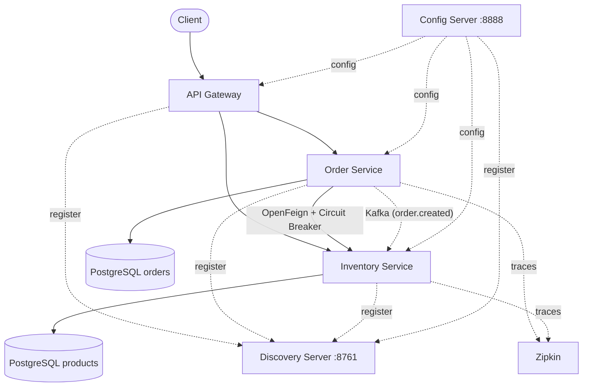

# CircuitMart

A cloud-native e-commerce backend built with **Spring Boot 4.1 + Spring Cloud 2025.1.2** (Java 25), demonstrating service discovery, API gateway routing, centralized config, sync (Feign) & async (Kafka) inter-service communication, circuit breakers, distributed tracing, and centralized logging.


---

## Overview

CircuitMart implements a **5-service distributed architecture** covering the core building blocks of an enterprise Spring Cloud system:

| Service | Role |
|---|---|
| **Discovery Service** | Eureka registry — service registration, discovery, health monitoring |
| **Config Server** | Git-backed centralized configuration with `@RefreshScope` support |
| **API Gateway** | Single entry point — request routing, JWT validation, custom gateway filters |
| **Inventory Service** | Product CRUD, stock tracking, availability checks |
| **Order Service** | Order creation/tracking, inventory validation (Feign), Kafka event publishing |

Every service is independently deployable, registers with Eureka, pulls config from Config Server, and emits traces to Zipkin.

> 📖 For a **deep dive** into the architecture — service flows, communication patterns, resilience, database design, security, known issues, and 15 FAQs — see [`SYSTEM.md`](./SYSTEM.md).

---

## Architecture



---

## Key Features

| Feature | What & Why |
|---|---|
| **Service Discovery** | Dynamic registration via Eureka — no hardcoded host:port |
| **Centralized Config** | Git-backed Config Server — auditable, versioned, runtime-refreshable |
| **Sync Inter-service** | OpenFeign between Order → Inventory (blocking, returns total price needed for order) |
| **Async Messaging** | Kafka via Spring Cloud Stream — Order publishes events, Inventory consumes them async |
| **Circuit Breaker** | Resilience4J around Feign calls — prevents cascading failures |
| **JWT Auth** | Validated at the Gateway level — downstream services stay stateless |
| **Distributed Tracing** | Micrometer + Brave + Zipkin — trace IDs propagate across HTTP, Feign, and Kafka |
| **DTO Projection** | ModelMapper for entity → DTO mapping with loose matching strategy |

---

## Tech Stack

| Layer | Technologies |
|---|---|
| **Core** | Java 25, Spring Boot 4.1.0, Spring Data JPA, Hibernate |
| **Cloud** | Spring Cloud 2025.1.2, Eureka, Spring Cloud Gateway (WebFlux), OpenFeign, Resilience4J |
| **Messaging** | Apache Kafka 3.7.1, Spring Cloud Stream Kafka Binder |
| **Security** | JWT (jjwt 0.12.6), Gateway-level authorization |
| **Database** | PostgreSQL |
| **Configuration** | Spring Cloud Config Server (Git-backed) |
| **Observability** | Zipkin (distributed tracing) |
| **Build** | Maven (each service is an independent project) |

---

## Project Structure

```text
CircuitMart
├── discovery-service       # Eureka server (:8761)
├── config-server           # Git-backed config server (:8888)
├── api-gateway             # Spring Cloud Gateway + JWT validation
├── inventory-service       # Product CRUD, stock, Kafka consumer
├── order-service           # Order lifecycle, Feign client, Kafka producer
├── docker-compose.yml      # Kafka 3.7.1 container
├── SYSTEM.md               # Full architecture deep dive
└── README.md
```

Base package: `com.smit.{service_name}` (e.g. `com.smit.order_service`)

---

## Communication Flow

### Order Creation (end-to-end)

```
Client → POST /orders/create-order
  │
  ▼
API Gateway (JWT validation → X-User-Id header)
  │
  ▼
Order Service
  ├── 1. Feign → Inventory Service POST /inventory/products/reduce-stocks
  │       └── Returns total price (circuit breaker protected)
  ├── 2. Save order to PostgreSQL (status: CONFIRMED)
  └── 3. Publish OrderCreatedEvent to Kafka topic "order.created"
          │
          ▼
      Inventory Service (consumer group: inventory-service)
          └── Calls ProductService.reduceStocks() — deducts inventory
```

---

## Getting Started

### Prerequisites

- Java 25
- Maven 3.9+
- PostgreSQL (running locally, databases: `order-service`, `inventory-service`)
- Docker (for Kafka)
- Git access to `circuitmart-config-server` repo (`GITHUB_ACCESS_TOKEN` env var required)

### Startup Order

```bash
# 0. Kafka (must be first)
docker compose up -d

# 1. Discovery Service
cd discovery-service && mvn spring-boot:run

# 2. Config Server
cd config-server && mvn spring-boot:run

# 3. API Gateway
cd api-gateway && mvn spring-boot:run

# 4. Inventory Service
cd inventory-service && mvn spring-boot:run

# 5. Order Service
cd order-service && mvn spring-boot:run
```

Eureka dashboard: `http://localhost:8761`

---

## Author

**Smit Roy** — Java Backend Developer | Spring Boot | Microservices | PostgreSQL

GitHub: [github.com/smitroy4](https://github.com/smitroy4)

---

## License

This project is intended for educational, learning, and portfolio purposes.
