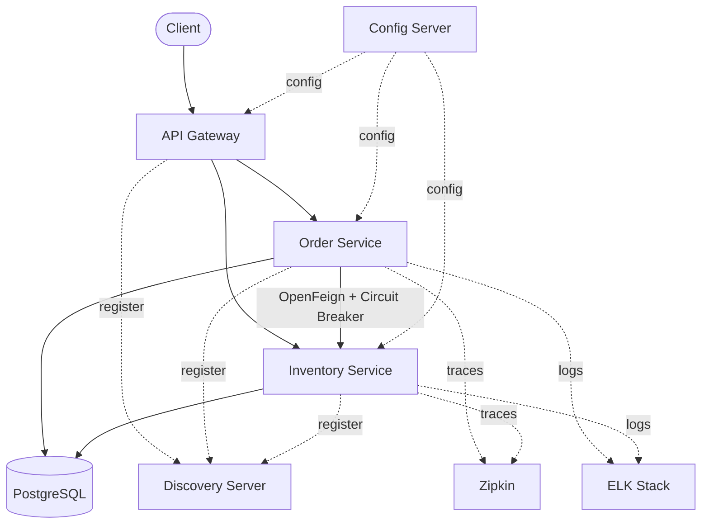

# CircuitMart

A cloud-native e-commerce backend built with **Spring Boot Microservices**, demonstrating service discovery, API gateway routing, centralized configuration, fault tolerance, distributed tracing, and centralized logging.


---

## Overview

CircuitMart implements a five-service distributed architecture covering the core building blocks of an enterprise Spring Cloud system: registry, gateway, config server, and two business services that talk to each other over Feign with circuit breaker protection. Every service is independently deployable, registers itself with Eureka, pulls configuration from a Config Server, and emits traces/logs to Zipkin and the ELK stack.

---

## Architecture



---

## Services

| Service | Responsibility | Port |
|---|---|---|
| **Discovery Service** | Eureka registry — service registration, discovery, health monitoring | `8761` |
| **Config Server** | Centralized, environment-specific configuration with `RefreshScope` support | `8888` |
| **API Gateway** | Single entry point — request routing, JWT validation, custom gateway filters | configured via Config Server |
| **Inventory Service** | Product CRUD, stock tracking, availability checks | configured via Config Server |
| **Order Service** | Order creation/tracking, inventory validation (Feign), order status management | configured via Config Server |

---

## Tech Stack

| Layer | Technologies |
|---|---|
| Core | Java 25, Spring Boot 4, Spring Data JPA, Hibernate |
| Microservices | Spring Cloud, Eureka, Spring Cloud Gateway, OpenFeign, Resilience4J |
| Security | JWT Authentication, Gateway-level authorization |
| Database | PostgreSQL |
| Configuration | Spring Cloud Config Server |
| Observability | Zipkin (distributed tracing), ELK Stack (centralized logging) |
| Build | Maven |

---

## Key Features

- **Service discovery & registration** — all services register with Eureka and resolve each other dynamically.
- **Centralized configuration** — externalized properties via Config Server, refreshable at runtime.
- **Resilient inter-service calls** — Order → Inventory communication via OpenFeign, wrapped in a Resilience4J circuit breaker with fallback.
- **Secured gateway** — JWT validation and custom filters at the API Gateway, keeping downstream services stateless.
- **Observability** — request-level distributed tracing via Zipkin and centralized log aggregation via the ELK stack.
- **Persistence** — PostgreSQL with Spring Data JPA / Hibernate for both Inventory and Order services.

---

## Project Structure

```text
CircuitMart
├── discovery-service     # Eureka server
├── config-server         # Centralized configuration
├── api-gateway           # Spring Cloud Gateway + JWT validation
├── inventory-service      # Product/inventory CRUD
└── order-service          # Order lifecycle, Feign client to Inventory
```

Base package: `com.smit`

```text
com.smit.discovery_service
com.smit.config_server
com.smit.api_gateway
com.smit.inventory_service
com.smit.order_service
```

---

## Getting Started

### Prerequisites

- Java 21+
- Maven 3.9+
- PostgreSQL (running locally or via Docker)
- Git

### Run Order

Services must be started in this sequence so dependent services can register and pull config successfully:

```bash
# 1. Config Server
cd config-server
mvn spring-boot:run

# 2. Discovery Service
cd discovery-service
mvn spring-boot:run

# 3. API Gateway
cd api-gateway
mvn spring-boot:run

# 4. Inventory Service
cd inventory-service
mvn spring-boot:run

# 5. Order Service
cd order-service
mvn spring-boot:run
```

Once all services are registered, the Eureka dashboard is available at `http://localhost:8761`.

---

## Author

**Smit Roy**
Java Backend Developer | Spring Boot | Microservices | PostgreSQL

GitHub: [github.com/smitroy4](https://github.com/smitroy4)

---

## License

This project is intended for educational, learning, and portfolio purposes.
